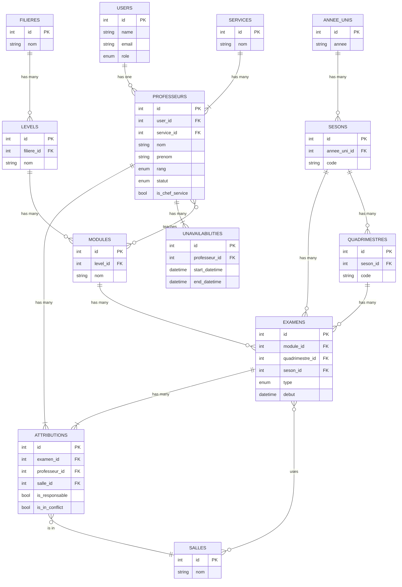

# Documentation: Core Database Schema

This document provides a high-level overview of the core database relationships in the PROXAM application.

## Entity-Relationship Diagram (ERD)

The following diagram illustrates the primary relationships between Users, Professors, Exams, and the academic structure.

## Key Relationships Explained

-   **Users & Professors:** The `users` table handles authentication and roles. Every `professeurs` record **must** have a corresponding `users` record (`one-to-one`). This is the most critical link in the system.
-   **Academic Hierarchy:** The structure is `Filieres` -> `Levels` -> `Modules`. A Study Field has many Levels, and a Level has many Modules. This creates the academic curriculum.
-   **Professors & Modules:** A many-to-many relationship exists via the `professeur_modules` pivot table. This defines which subjects a professor is qualified to teach.
-   **Exams:** An `examens` record is the central event. It belongs to one `Module`, one `Quadrimestre`, and one `Seson`. It can be held in many `Salles` (via the `examens_salles` pivot table).
-   **Attributions (Assignments):** This is the "join" table that connects everything. An `attributions` record links one `Professeur` to one `Examen` in a specific `Salle`. This is the record that represents a single professor's duty on exam day.
-   **Unavailabilities & Conflicts:** An `unavailabilities` record simply belongs to a `Professeur`. The conflict logic works by checking if an `attributions` record's exam time overlaps with any of the professor's `unavailabilities`.