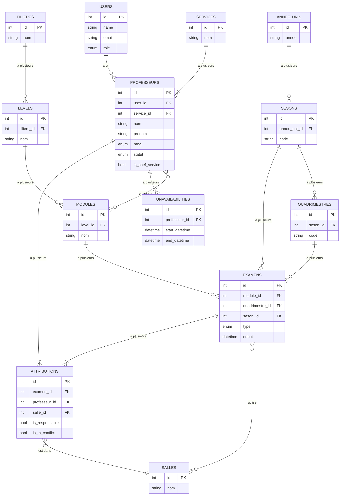

# Documentation : Schéma de Base de Données Principal

Ce document fournit un aperçu de haut niveau des relations de base de données principales dans l'application PROXAM.

## Diagramme Entité-Relation (DER)

Le diagramme suivant illustre les relations primaires entre les Utilisateurs, les Professeurs, les Examens et la structure académique.

## Explication des Relations Clés

-   **Utilisateurs et Professeurs :** La table `users` gère l'authentification et les rôles. Chaque enregistrement `professeurs` **doit** avoir un enregistrement `users` correspondant (`un-à-un`). C'est le lien le plus critique du système.
-   **Hiérarchie Académique :** La structure est `Filieres` -> `Levels` -> `Modules`. Un domaine d'études a plusieurs Niveaux, et un Niveau a plusieurs Modules. Cela crée le cursus académique.
-   **Professeurs et Modules :** Une relation plusieurs-à-plusieurs existe via la table pivot `professeur_modules`. Cela définit les matières qu'un professeur est qualifié pour enseigner.
-   **Examens :** Un enregistrement `examens` est l'événement central. Il appartient à un `Module`, un `Quadrimestre` et une `Seson`. Il peut être tenu dans plusieurs `Salles` (via la table pivot `examens_salles`).
-   **Attributions (Affectations) :** C'est la table de "jointure" qui relie tout. Un enregistrement `attributions` lie un `Professeur` à un `Examen` dans une `Salle` spécifique. C'est l'enregistrement qui représente le devoir d'un seul professeur le jour de l'examen.
-   **Indisponibilités et Conflits :** Un enregistrement `unavailabilities` appartient simplement à un `Professeur`. La logique de conflit fonctionne en vérifiant si l'heure d'examen d'un enregistrement `attributions` chevauche l'une des `unavailabilities` du professeur.
